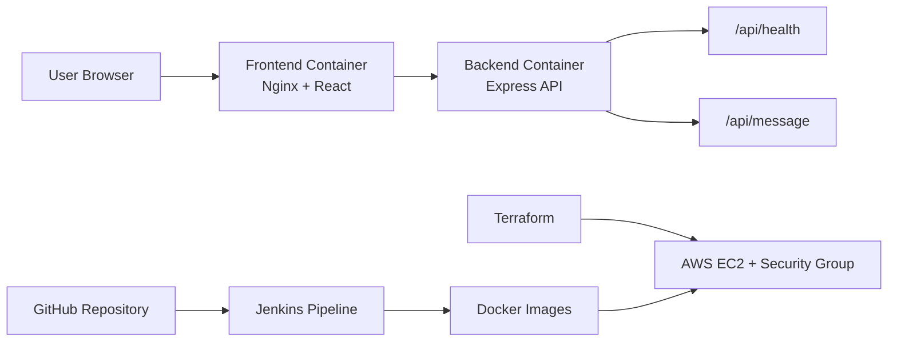
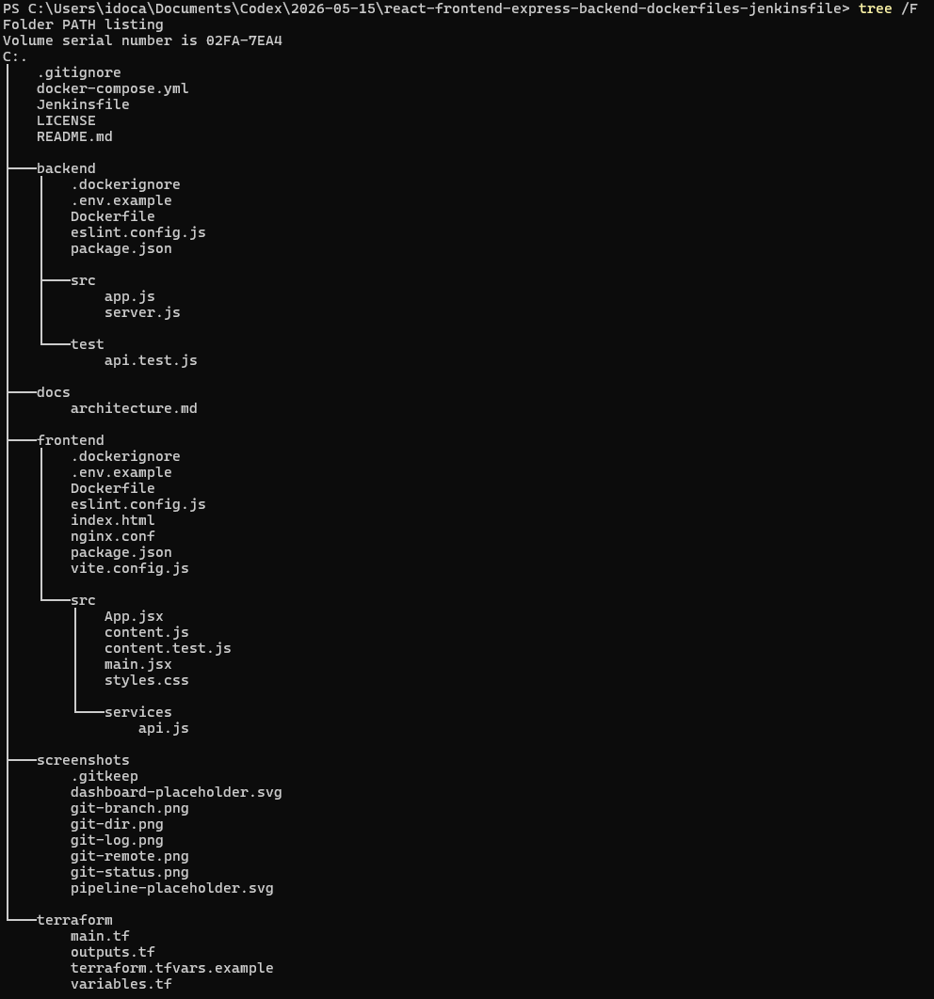
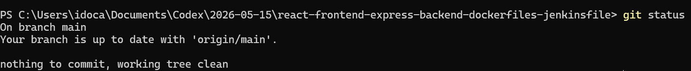
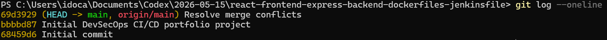
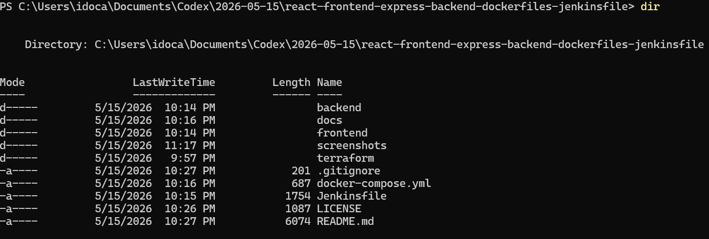
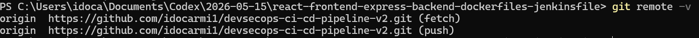
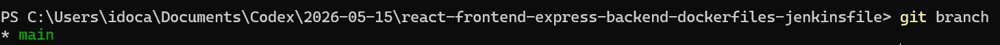

# DevSecOps CI/CD Portfolio Project

A production-style portfolio project for a junior DevOps engineer: React dashboard, Express API, Docker, Jenkins CI/CD, and Terraform infrastructure for AWS EC2. It is designed for GitHub and LinkedIn presentation by showing clear engineering structure, practical automation, and cloud deployment awareness.

This project is especially suited for a Business Administration & Information Systems student with networking and DevOps background because it connects application delivery, infrastructure, security groups, CI/CD, and operational documentation in one clean repository.

## Architecture



More detail is available in [docs/architecture.md](docs/architecture.md).

## Technologies Used

- React with Vite for the frontend dashboard
- Express.js for the backend API
- Docker and Docker Compose for containerized local runtime
- Jenkins declarative pipeline for CI/CD workflow
- Terraform for AWS EC2 infrastructure
- Nginx for serving the frontend and proxying API requests
- Helmet and CORS middleware for basic API hardening

## Project Structure

```text
.
|-- backend/
|   |-- src/
|   |   |-- app.js
|   |   `-- server.js
|   |-- test/
|   |   `-- api.test.js
|   |-- Dockerfile
|   |-- .env.example
|   `-- package.json
|-- docs/
|   `-- architecture.md
|-- frontend/
|   |-- src/
|   |   |-- services/
|   |   |   `-- api.js
|   |   |-- App.jsx
|   |   |-- content.js
|   |   `-- styles.css
|   |-- Dockerfile
|   |-- nginx.conf
|   |-- .env.example
|   `-- package.json
|-- screenshots/
|   |-- git-branches.png
|   |-- git-history.png
|   |-- git-remote.png
|   |-- git-status.png
|   |-- project-files.png
|   `-- repository-tree.png
|-- terraform/
|   |-- main.tf
|   |-- variables.tf
|   |-- outputs.tf
|   `-- terraform.tfvars.example
|-- docker-compose.yml
|-- Jenkinsfile
|-- .gitignore
`-- README.md
```

## Application Features

- Modern dashboard UI for a DevSecOps portfolio
- API health check displayed in the frontend
- Express `/api/health` endpoint with service metadata
- Express `/api/message` endpoint with portfolio context
- Environment variable support for frontend and backend
- Dockerized frontend and backend services
- Jenkins pipeline with Install, Test, Build, Docker Build, and Deploy Simulation stages
- Terraform EC2 example with security group, variables, and outputs

## Local Setup

### Backend

```bash
cd backend
cp .env.example .env
npm install
npm run dev
```

The backend runs on `http://localhost:5000`.

### Frontend

```bash
cd frontend
cp .env.example .env
npm install
npm run dev
```

Open `http://localhost:3000`. Vite proxies `/api` requests to the backend during local development.

## Test Commands

Run quality checks from each app folder:

```bash
npm run lint
npm test
```

The backend tests use Node's built-in test runner and call the Express app on a random local port. The frontend test verifies that dashboard content reflects the intended CI/CD lifecycle.

## Docker Instructions

Run the complete stack:

```bash
docker compose up --build
```

Open `http://localhost:8080`.

Runtime behavior:

- Frontend is served by Nginx on port `8080`.
- Backend runs on port `5000`.
- Nginx proxies `/api` traffic from frontend to backend inside the Compose network.

## Jenkins Pipeline

The [Jenkinsfile](Jenkinsfile) uses a declarative pipeline with these stages:

1. `Install`: installs frontend and backend dependencies.
2. `Test`: runs linting and tests for both services.
3. `Build`: builds the React app and checks the backend entrypoint.
4. `Docker Build`: builds separate Docker images for frontend and backend.
5. `Deploy Simulation`: models a deployment stage without requiring live AWS credentials.

For a real deployment, the final stage could push images to Amazon ECR, SSH to EC2, pull the images, and restart Docker Compose.

## Terraform AWS EC2

The Terraform configuration in [terraform](terraform) creates:

- Amazon Linux 2023 EC2 instance
- Security group with SSH, HTTP, and backend API ingress
- Docker and Git bootstrap through EC2 user data
- Useful outputs for public IP, DNS, and SSH command

Example:

```bash
cd terraform
cp terraform.tfvars.example terraform.tfvars
terraform init
terraform plan
terraform apply
```

Edit `terraform.tfvars` before applying. Use your existing AWS key pair name and restrict `ssh_cidr` to your public IP with `/32`.


## Environment Variables

Backend:

```text
NODE_ENV=development
PORT=5000
CORS_ORIGIN=http://localhost:3000
```

Frontend:

```text
VITE_API_BASE_URL=/api
```

## DevSecOps Notes

- Helmet adds basic HTTP security headers to the Express API.
- CORS is configured through an environment variable.
- Docker images use separate frontend and backend build contexts.
- Terraform keeps infrastructure values configurable through variables.
- Jenkins separates install, test, build, image creation, and deployment concerns.

## Future Improvements

- Push Docker images to Amazon ECR.
- Add a real Jenkins deployment step to EC2.
- Add HTTPS with an Application Load Balancer and ACM certificate.
- Move Terraform state to an S3 backend with DynamoDB locking.
- Add Trivy or Grype container scanning.
- Add SonarQube or ESLint security scanning.
- Add CloudWatch logs and alarms.
- Add GitHub Actions as an alternative CI pipeline.

  ## Screenshots

### Repository Structure


### Git Status


### Git History


### Project Files


### Git Remote


### Git Branches


