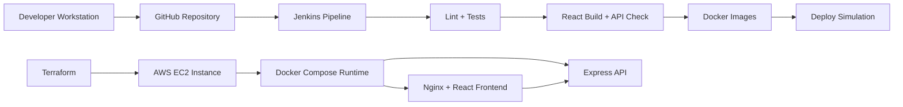

# Architecture

This project demonstrates a practical CI/CD path for a containerized React and Express application.

## Runtime Flow

1. The browser loads the React dashboard from the frontend container.
2. Nginx serves static files and proxies `/api` requests to the backend service.
3. Express returns `/api/health` and `/api/message` responses.
4. Docker Compose wires both services together for local and EC2-style deployment practice.

## CI/CD Flow

1. Jenkins installs dependencies for both applications.
2. Jenkins runs linting and tests.
3. Jenkins builds the frontend and checks the backend entrypoint.
4. Jenkins builds separate Docker images.
5. Jenkins runs a deploy simulation stage to model a real release gate without requiring live AWS credentials.

## Infrastructure Flow

Terraform provisions a basic AWS EC2 instance with a security group and startup script that installs Docker and Git. This is intentionally simple for learning and portfolio demonstration.

